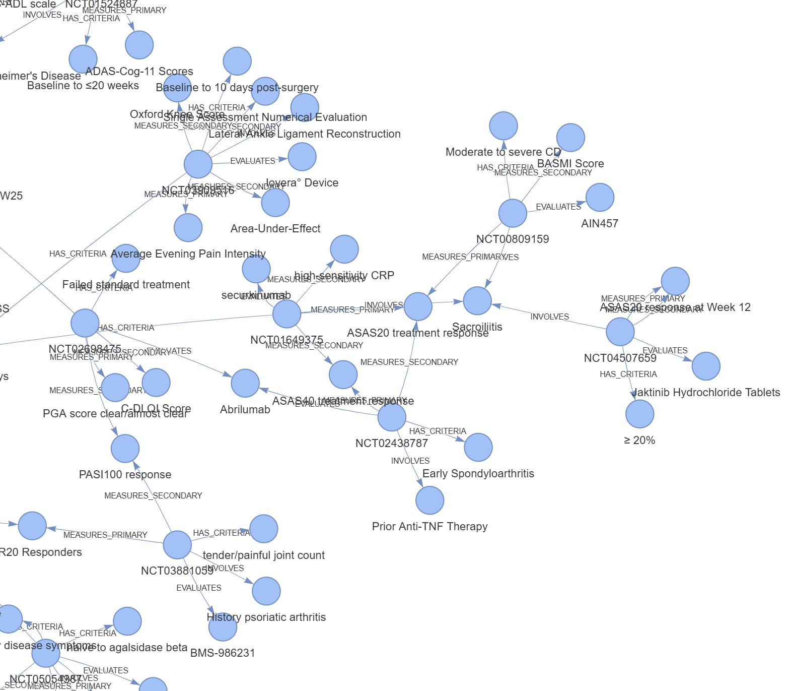
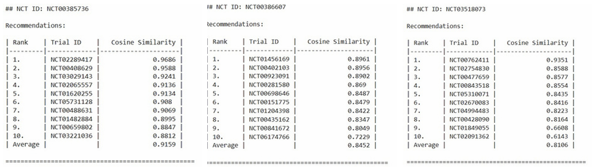

# Neo4j Clinical Trials Recommendation System


---

## 🌟 Project Overview

This repository hosts our innovative project developed for the NEST 2025 Hackathon. We use semantic technology and knowledge graphs to enhance clinical trial recommendations. Our system processes and retrieves clinical trials to offer strategic insights and effective recommendations.

---

## 📊 Interactive Graph Visualization

Explore our Neo4j graph through an interactive HTML visualization showcasing the relationships between clinical trials.

[**View Graph Visualization**](neo4j_graph_visualization.html)

---

## 🚀 Quick Setup

1. **Install Requirements**
   ```bash
   pip install -r requirements.txt
   ```
2. **Run the Scripts**
   - Set up the database and prepare the environment by running the provided scripts in sequence:
     - `CreateRelationship.py`
     - `SimilarEntities.py`
     - `ingest.py`
     - `model.py`

---

## 🛠️ Components

- **Data Preprocessing**: Scripts to clean and prepare clinical trial data.
- **Knowledge Graph Construction**: Uses Neo4j to build a scalable graph representing clinical trial data.
- **Recommendation Engine**: Utilizes Jaccard similarity metrics within Neo4j's GDS to rank similar clinical trials.

---

## 🎖️ Achievements

- **Semifinals in NEST Hackathon 2025**: Our approach has demonstrated significant potential to enhance clinical trial designs, advancing to the semifinals.
- **Effective Use of AI**: Leveraging AI to derive meaningful insights from complex data.

---

## 📄 Additional Documentation

- [**User Guide**](UserGuide.pdf): Detailed instructions on setting up and using the repository.

---

## 📸 Screenshots

Here are some visual highlights from various stages of the project:

### Clinical Trials Data Processing
This image showcases the initial data preprocessing phase where clinical trial data is cleaned and prepared for analysis.

---


### Recommendation Engine Output
Below is a snapshot of the output from our recommendation engine, illustrating the type of clinical trial recommendations generated by our system.

---


*Sample output of recommended clinical trials*
